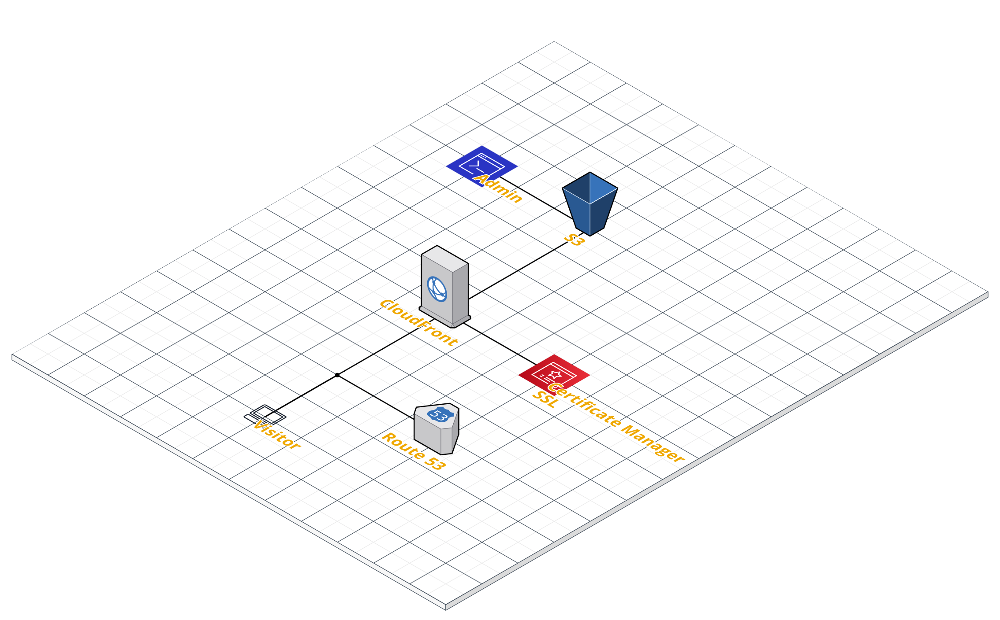
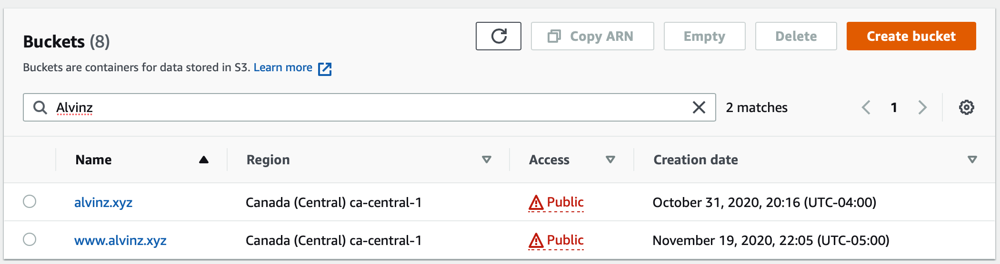
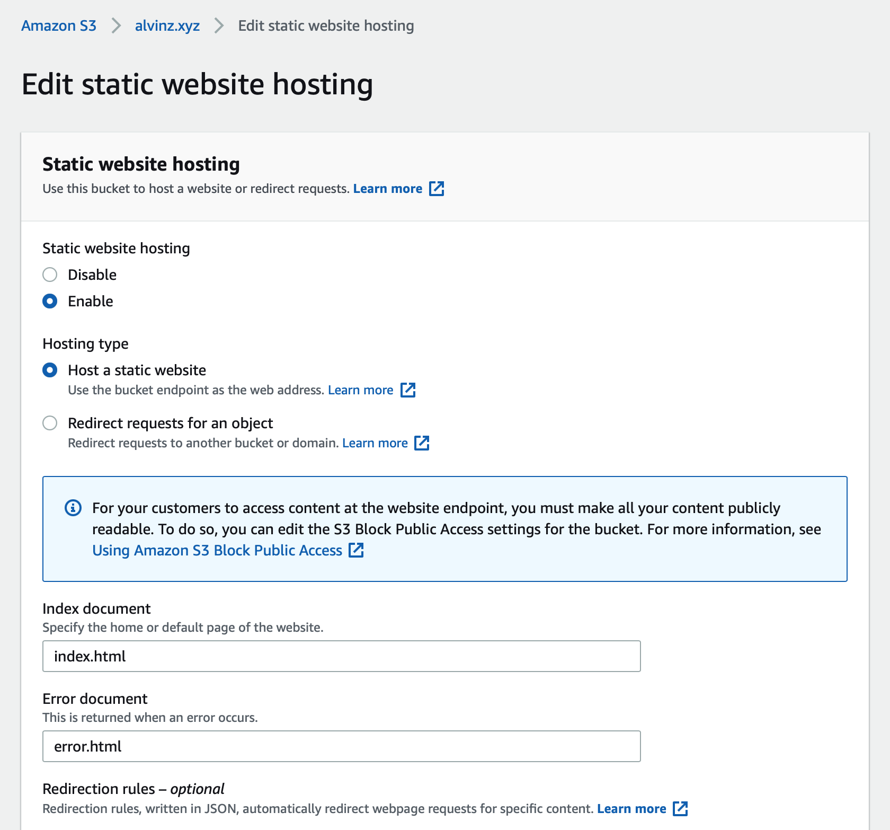
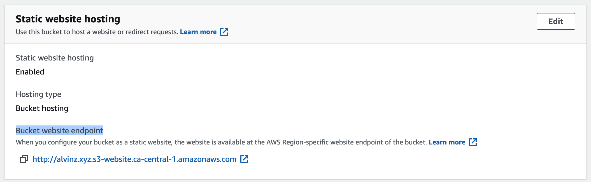
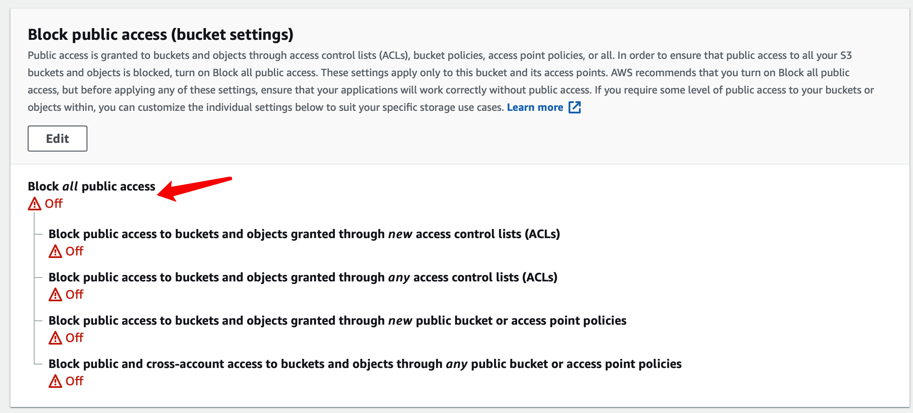

# 为什么关注静态网站/静态内容
> 使用非常广泛，可以说它无处不在，甚至是你应用的大部分。

静态网站，仅使用静态文件（如 HTML、CSS、JavaScript、图像和视频），并且不需要服务器或服务器端处理。

在实际应用中，我们会有这样的静态内容：
1. 静态博客（例如hexo）
2. 静态内容（例如wordpress发布的文本、图片、视频）
3. 系统缓存内容（例如电子商务系统中的商品图片，根据不同场景缩放了的缓存图片）
4. SPA应用程序
5. 缓存资料
6. ...

优势：功能强大且价格低廉

# 使用到的AWS服务

- S3
  - 存储静态内容
  - 可以配置为托管静态网站
- CloudFront
  - CDN（内容分发网络）
  - 使您的网站加载速度更快
- Certificate Manager
  - 提供免费的 HTTPS 证书
- Route 53
  - 提供域名服务

# 实战步骤

本文章以host静态网站为例。

- Admin管理员：管理和更新静态资源
- Visitor访问者：浏览网站内容



## 第一步：确定域名，并以域名建立S3 Bucket

登录AWS Console，建立两个同名bucket，一个yourdomain，另一个www.yourdomain（例如：alvinz.xyz）


并进行如下的设置

### 1. 启用static website hosting

进入Bucket->Properties->Static Website Hosting



保存后，你将可以看到Bucket Website Endpoint（稍后的设置会用到）


### 2. 设置访问权限为publish

进入Bucket->Permissions



并在Bucket Policy进行如下设置

```
{
    "Version": "2008-10-17",
    "Statement": [
        {
            "Sid": "AllowPublicRead",
            "Effect": "Allow",
            "Principal": {
                "AWS": "*"
            },
            "Action": "s3:GetObject",
            "Resource": "arn:aws:s3:::你的Bucket名字（例如alvinz.xyz）/*"
        }
    ]
}
```

## 第二步：上传静态内容到S3

可以使用AWS console在网站上上传，也可以使用AWS CLI上传，详细请浏览另外一篇关于S3的文章。

至此，你就可以通过Bucket Website Endpoint浏览网站了。

## 第三步：设置域名Route 53

## 第四步：设置cloudfront和SSL


# 进阶：如何安全保护静态资源
由 HTTPS 和其他安全标头保护 – 此解决方案在 AWS Certificate Manager (ACM) 中创建 SSL/TLS 证书，并将其附加到 CloudFront 分配。此证书使分配能够使用 HTTPS 安全地为您的域名网站提供服务。

此解决方案还使用 Lambda@Edge 向每个服务器响应添加安全标头。安全标头是 Web 服务器响应中的一组标头，它们告诉 Web 浏览器采取额外的安全预防措施。有关更多信息，请参阅此博客文章：使用 Lambda@Edge 和 Amazon CloudFront 添加 HTTP 安全标头。


通过 Internet 分发内容的企业经常会希望限制对文档、商业数据、媒体流或其他内容的访问权限，从而仅限付费客户等选定的用户可以请求这些内容。通过使用 CloudFront，我们可以设置地理限制、签名 URL、签名 Cookie 等额外的访问限制，从而根据不同的条件进一步限制对内容的访问。

CloudFront 的另一个安全功能是源访问身份 (OAI)，此功能会将 S3 存储桶及其内容限制为仅限 CloudFront 以及它所执行的操作可以访问。此博文中的 CloudFormation 模板包含了 OAI，以帮助确保您的内容得到保护和限制。


CloudFront 包含额外的保护功能，防止恶意利用漏洞。为提供这些保护，CloudFront 集成了 Web 应用程序防火墙 [AWS WAF](https://aws.amazon.com/waf/)（它可帮助保护 Web 应用程序，防止常见的 Web 漏洞利用行为）以及 [AWS Shield](https://aws.amazon.com/shield/)（适用于在 AWS 上运行的 Web 应用程序的托管 DDoS 防护服务）。AWS WAF 可让您按自己指定的条件控制对内容的访问，例如按 IP 地址或内容查询的查询字符串值。然后 CloudFront 会在满足条件时返回请求的内容，或返回一个 HTTP 403 状态代码（禁止访问）。所有 CloudFront 客户都可免费享受 AWS Shield Standard 提供的自动防护。如果客户希望获得更深入的见解，增强风险化解能力，以及面对 DDoS 攻击时的成本保护，则可以使用 [AWS Shield Advanced](https://aws.amazon.com/shield/tiers/)。

关于安全保护的更多内容请浏览

[这里]: https://aws.amazon.com/cn/blogs/china/amazon-s3-amazon-cloudfront-%E4%BA%91%E4%B8%AD%E7%9A%84%E7%BB%9D%E5%A6%99%E6%90%AD%E9%85%8D/


## 限制对内容的访问

许多通过互联网分发内容的公司都希望限制对文档、业务数据、流媒体或面向一部分用户的内容的访问。要使用 Amazon CloudFront 安全地提供此内容，您可执行以下一个或多个操作：

- **使用签名 URL 或 Cookie**

  您通过 CloudFront，使用签名 URL 或签名 Cookie 来提供此私有内容，从而限制面向选定用户（例如，付费用户）的内容的访问。有关更多信息，请参阅[使用签名 URL 和已签名的 Cookie 提供私有内容](https://docs.aws.amazon.com/zh_cn/AmazonCloudFront/latest/DeveloperGuide/PrivateContent.html)。

- **限制对 Amazon S3 存储桶中内容的访问**

  例如，如果通过使用 CloudFront 签名 URL 或签名 Cookie 来限制对内容的访问，您还会希望人员无法使用文件的直接 URL 查看文件。而是希望他们只能通过使用 CloudFront URL 访问文件，这样您的保护才会发挥作用。如果您使用 Amazon S3 存储桶作为 CloudFront 分配的源，您可以设置源访问身份 (OAI) 来管理对内容的直接访问。源访问身份是一种特殊的 CloudFront 用户身份，您可以将其与您的分配关联，这样就可以保护您的全部或部分 Amazon S3 内容。有关如何配置此功能的详细信息，请参阅[使用源访问身份限制对 Amazon S3 内容的访问](https://docs.aws.amazon.com/zh_cn/AmazonCloudFront/latest/DeveloperGuide/private-content-restricting-access-to-s3.html)。

- **使用 AWS WAF Web ACL**

  您可以使用 Web 应用程序防火墙服务 AWS WAF 创建 Web 访问控制列表 (Web ACL) 来限制对内容的访问。根据指定的条件 (如请求源自的 IP 地址或查询字符串的值)，CloudFront 会使用所请求的内容或使用 HTTP 状态代码 403 (Forbidden) 来响应请求。有关更多信息，请参阅 [使用 AWS WAF 控制对您的内容的访问](https://docs.aws.amazon.com/zh_cn/AmazonCloudFront/latest/DeveloperGuide/distribution-web-awswaf.html)。

- **使用地理限制**

  您可以使用*地理限制* （也称为*地理阻止* ）禁止特定地理位置的用户访问您通过 CloudFront 分配提供的内容。配置地理限制时有多个选项可供选择。有关更多信息，请参阅 [限制您的内容的地理分配](https://docs.aws.amazon.com/zh_cn/AmazonCloudFront/latest/DeveloperGuide/georestrictions.html)。

  

# 进阶：让流程畅顺起来
使用 AWS CloudFormation 进行配置和部署 – 此解决方案使用 AWS CloudFormation 模板来设置所有组件，因此，您可以更多地关注网站的内容，而更少地关注配置组件。
