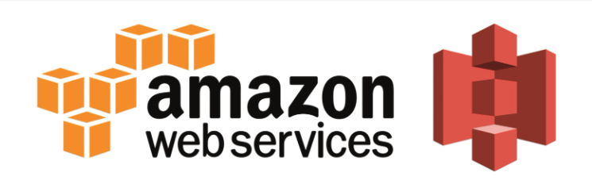
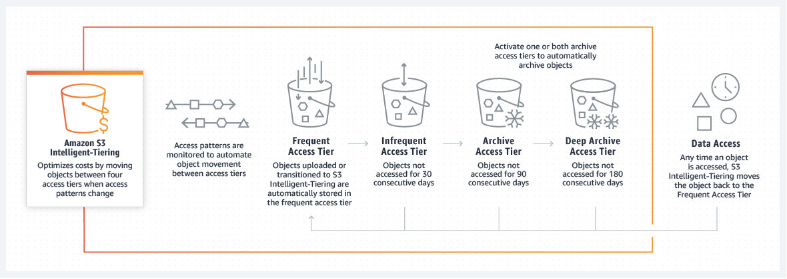

# 企业上云：使用AWS S3



## 为什么使用AWS S3

Amazon S3全称是Amazon Simple Storage Service， 是一种对象存储服务，提供行业领先的可扩展性、数据可用性、安全性和性能。这意味着各种规模和行业的客户都可以使用 S3 来存储并保护各种用例（如数据湖、网站、移动应用程序、备份和还原、存档、企业应用程序、IoT 设备和大数据分析）的数据，容量不限。Amazon S3 提供了易于使用的管理功能，因此您可以组织数据并配置精细调整过的使用权限控制，从而满足特定的业务、组织和合规性要求。Amazon S3 可达到 99.999999999%（11 个 9）的持久性，并为全球各地的公司存储数百万个应用程序的数据。

与百度网盘等免费存储服务相比，S3 没有政策风险，不会有人检查和删除你的数据，也不会有限速和强制安装客户端之类的事情。与 Dropbox / iCloud 等订阅存储服务相比，S3 按需付费的机制在一些情形下更为廉价。S3 便捷和不受限制的共享能力也是一个加分项。

### AWS S3的商业优势

#### 极高的可靠性

Amazon S3 可达到 99.999999999%（11 个 9）的数据持久性，因为 S3 会自动创建并存储跨多个系统的所有 S3 对象的副本。这意味着您的数据在需要时可用，并可抵御故障、错误和威胁。

#### 满足各种场景的存储级别



S3 智能分层通过在访问模式发生变化时在四个访问层之间移动对象来优化存储成本。有两个已针对频繁访问和不频繁访问而优化的低延迟访问层，可帮助您节省高达 40% 的存储成本；还有两个专为异步访问而设计的选择性加入存档访问层，对于很少访问的对象，可节省高达 95％ 的成本。 

上传或转换到 S3 智能分层的对象将自动存储在频繁访问层中。S3 智能分层的工作方式是监控访问模式，然后将连续 30 天未访问的对象移动到不频繁访问层。在您激活一个或两个存档访问层后，S3 智能分层会将连续 90 天未被访问的对象移动到存档访问层，然后在连续 180 天物访问后，将其移动到深度存档访问层。如果稍后访问了对象，S3 智能分层会将该对象移回频繁访问层。

没有任何检索费用，因此在访问模式发生变化时存储账单不会意外增加。了解有关[优化存储成本](https://aws.amazon.com/cn/s3/cost-optimization/)的信息。

#### 生命周期的管理

除了手动指定，或者使用 INTELLIGENT_TIERING 外，S3 其实还可以让我们在 bucket 上定义生命周期管理的策略（Policy），来自动转换对象的存储级别。

生命周期的管理可以做到： 1. 转换存储级别 2. 过期删除

#### 灵活高级别的数据安全

1. 访问限制ACL
2. 多版本管理
   不小心把数据删除了的痛，程序员应该都懂。但是，后悔药是没有的。版本管理的功能就极其重要了，有了它，你可以随时回到过去。当然，你要强行删除特定版本的数据也是可以的，它只是让这件事变得难一些而已。它甚至可以把 bucket 设置成只有通过 MFA 认证的请求才能实现永久删除。
   要注意的是： 1. 打开版本控制的 bucket，是没法关闭的，顶多可以暂停。也就是说，暂停后的 bucket，新加对象的时候，版本 id 会设为 null。 2. 无论打开，或者暂停版本控制，对 bucket 内已经存在的对象是没有影响的。
3. 锁定write-once-read-many (WORM)

#### 很低的价格

S3 不是会员制的订阅服务，而是像水电一样按使用量计费。费用主要由两个部分组成：

1. $0.023 每 GB 的存储费，这一部分按月收取。

2. $0.09 每 GB 的下载费。

   

## 使用AWS S3

AWS S3可以存储任何的文件，扔上去就是了。这里介绍一下使用很频繁的一些操作：通过AWS CLI来管理S3。

### 安装pip （如果还没有安装）

检查是否已经安装pip

```
python3 -m pip --version
```

如果没有安装，继续下面的操作

```
sudo apt install python3
```

Python >=3.4 can self-bootstrap pip with the built-in [ensurepip](https://packaging.python.org/key_projects/#ensurepip) module. Refer to the standard library documentation for more details. Make sure to [upgrade pip](https://pip.pypa.io/en/latest/installing/#upgrading-pip) after `ensurepip` installs pip.

使用get-pip.py安装

```
curl https://bootstrap.pypa.io/get-pip.py -o get-pip.py
python3 get-pip.py
```


如果出现无法使用Python 3.5的问题，可以使用下面的方法安装

```
#Looks like you upgraded pip to a version that doesn't support your Python version.
#Uninstall pip and reinstall the system pip:

sudo apt purge python-pip python3-pip
sudo rm -rf /usr/local/lib/python2.7/dist-packages/pip
sudo rm -rf /usr/local/lib/python3.4/dist-packages/pip
sudo apt install python-pip python3-pip
```


### 安装AWS CLI

```
pip install awscli
```


## 常用命令

查看文件

```
aws s3 ls s3://bucket名称
```

压缩文件

```
tar zcvf FileName.tar.gz DirName
```

上传到S3，您可以使用一条文件夹级命令执行多文件递归上传和下载。AWS CLI 将并列进行这些传输，以便获得更高的性能。

```
# 整个目录上传
aws s3 cp myfolder s3://mybucket/myfolder --recursive

# 单个文件上传
aws s3 cp filename s3://mybucket/myfolder
```

更多AWS S3命令请参考

- [`aws s3`](https://docs.aws.amazon.com/cli/latest/reference/s3/)

- [`aws s3 cp`](https://docs.aws.amazon.com/cli/latest/reference/s3/cp.html)

- [`aws s3 mb`](https://docs.aws.amazon.com/cli/latest/reference/s3/mb.html)

- [`aws s3 mv`](https://docs.aws.amazon.com/cli/latest/reference/s3/mv.html)

- [`aws s3 ls`](https://docs.aws.amazon.com/cli/latest/reference/s3/ls.html)

- [`aws s3 rb`](https://docs.aws.amazon.com/cli/latest/reference/s3/rb.html)

- [`aws s3 rm`](https://docs.aws.amazon.com/cli/latest/reference/s3/rm.html)

- [`aws s3 sync`](https://docs.aws.amazon.com/cli/latest/reference/s3/sync.html)

  

