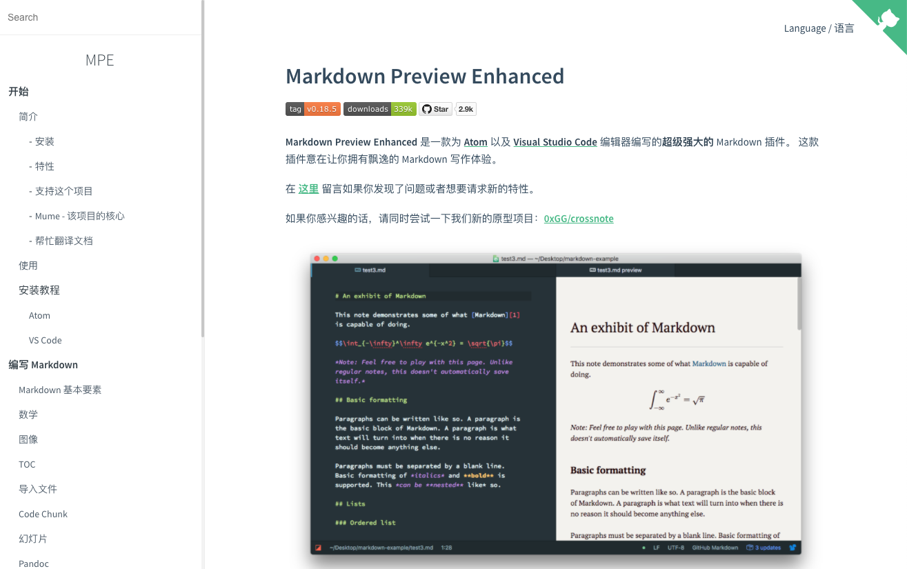

> 因为，除了写代码，我们还需要写文档。docsify可以让你很优雅的来写文档。
> 有docsify，程序员也爱写文档 

<!--more-->

## 什么是docsify

> 一个神奇的文档网站生成工具

先来看看出来的效果，使用docsify，很简单就可以输出这样专业的内容网站了。



[点解这里体验一下]: https://shd101wyy.github.io/markdown-preview-enhanced


## 为什么推荐程序员使用

> 因为，除了写代码，我们还需要写文档。docsify可以让你很优雅的来写文档。

在做完项目的时候经常会写一些项目手册，来记录我们在项目开发过程中的一些开发流程、使用方式以及注意事项，分享给别人。

目前比较好的方式就是写成Markdown格式的技术文档，方便我们发布在github上，同时也可以发布到博客分享平台。

docsify 是一个动态生成文档网站的工具。不同于 GitBook、Hexo 的地方是它不会生成将 `.md` 转成 `.html` 文件，所有转换工作都是在运行时进行。只需要创建一个 `index.html` ，就可以开始写文档而且直接部署在 GitHub Pages进行发布，方便、快捷、格式友好，样式不错。


> - 无需构建，写完文档直接发布
> - 容易使用并且轻量 (~19kB gzipped)
> - 智能的全文搜索
> - 提供多套主题
> - 丰富的 API
> - 支持 Emoji
> - 兼容 IE10+
> - 支持 SSR 


## 使用指南

### 1. 全局安装docsify

```undefined
npm i docsify-cli -g
```

### 2. 初始化项目

```kotlin
docsify init ./docs
```

初始化成功后，可以看到 `./docs` 目录下创建的几个文件

- index.html` 入口文件

- `README.md` 会做为主页内容渲染

- `.nojekyll` 用于阻止 GitHub Pages 会忽略掉下划线开头的文件

直接编辑 `docs/README.md` 就能更新网站内容，当然也可以写多个页面。

### 3. 本地预览网站

运行一个本地服务器，通过 `docsify serve` 可以方便的预览效果，而且提供 LiveReload 功能，可以实时的预览。默认通过 [http://localhost:3000](https://links.jianshu.com/go?to=http%3A%2F%2Flocalhost%3A3000)访问。

```undefined
docsify serve docs
```

就这么简单，开始用你熟悉的markdown编写内容吧。

更多的配置（例如封面、主题、多页面、部署等）请查看

[官网]: https://docsify.js.org/#/

